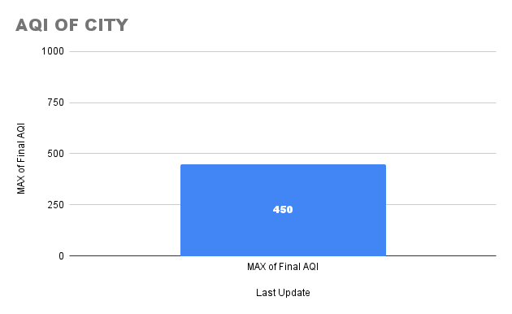
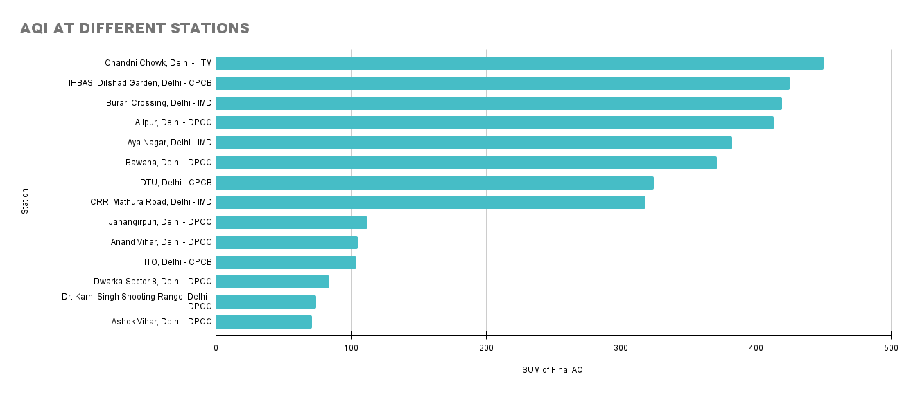
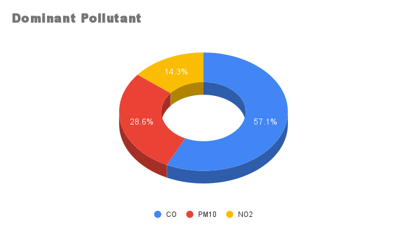

# 🧭 Real-Time City-Level Air Quality Monitoring Dashboard (India)

A dynamic and automated **Air Quality Monitoring Dashboard** built entirely in **Google Sheets**, powered by real-time data from the Government of India’s open data platform (data.gov.in). The dashboard allows **interactive selection of Indian cities**, shows **pollution levels at multiple stations**, and visualizes AQI metrics across pollutants in real-time.

---

## 📸 Project Screenshots

### 🟦 Dashboard Overview
> Includes max AQI, dominant pollutant, bar chart of station-wise AQI, pie chart for pollutant breakdown.



---

### 🟩 City Station-Wise AQI Chart



---

### 🟧 Dominant Pollutant Pie Chart



---

## 📌 Features

- 🔄 **Automatic Data Fetching via API** (data.gov.in)
- 🏙️ **City-Level Selection** using dropdown menu
- 🧪 **Station-wise pollutant readings** (PM2.5, PM10, NO2, SO2, CO, OZONE, NH3)
- 📈 **Dynamic Dashboard with Pivot Tables and Charts**
- 🎯 **AQI calculated from raw pollutant data using CPCB breakpoints**
- 📊 Charts include:
  - Dominant pollutant pie chart
  - Bar chart of station-wise AQI
  - Max AQI across city stations
- ⏱️ **Hourly auto-refresh** of data
- ☁️ **No external software required** — runs entirely in Google Sheets & Apps Script

---

## 🔧 How It Works

1. **Google Apps Script** fetches hourly AQI data from:
   > [data.gov.in - Real-Time Air Quality Index](https://www.data.gov.in/resource/real-time-air-quality-index-various-locations)

2. On opening the sheet:
   - A custom menu `AQI Tools` appears.
   - You select a city from a dropdown cell (`I1` in dashboard sheet).
   - Click **"Fetch Data for Selected City"** from the menu.
   - All valid pollutant data for that city is fetched and added to a hidden sheet.

3. AQI is calculated per station using CPCB breakpoints (for PM2.5, PM10, etc.).

4. Pivot tables and charts auto-update based on current data. (you may need to change the range in pivot tables as number of stations in each city are different)

---

## 🧮 AQI Calculation

AQI is computed using **CPCB AQI breakpoints** for each pollutant. The script uses the following formula:

AQI = ((Ihigh - Ilow)/(BPhigh - BPlow)) * (Cp - BPlow) + Ilow


Where:
- `Cp`: pollutant concentration
- `BPlow`, `BPhigh`: breakpoint range for that pollutant
- `Ilow`, `Ihigh`: corresponding AQI range

Only pollutants with valid `min`, `max`, and `avg` values are considered.

---

## 🗂️ Project Structure

dynamic-aqi-dashboard/
│
├── README.md
├── src/
│ ├── main.js # Main data fetch + menu setup
│ ├── claculateAQI.js # AQI calculation logic using CPCB breakpoints
│
├── sample_data/
│ └── city_raw.csv # Example dataset for testing
│
├── assets/
│ ├── AQI OF CITY.png
│ └── Dominant Pollutant.png
│ └── AQI AT DIFFERENT STATIONS.png


---

## 🚀 Setup Instructions

### 🛠️ Requirements:
- A Google account
- Access to [Google Sheets](https://sheets.google.com)
- Free API key from [data.gov.in](https://data.gov.in/user/login)

---

### ✅ Steps:

1. **Make a copy of the Sheet** or create a new one.
2. Go to `Extensions → Apps Script`.
3. Paste the code from `/src/` into `.gs` files.
4. Save and deploy the script.
5. Set the script property:
   ```js
   PropertiesService.getScriptProperties().setProperty("API_KEY", "YOUR_API_KEY_HERE");

6. Use Triggers to automate hourly refresh: 

fetchCityAQIData → every hour

clearDailyDataIfNeeded → daily at 00:00

7. Use the custom menu "AQI Tools" to fetch data manually or calculate AQI on demand.

8. Customize the dashboard visuals and pivot tables as needed.

---

## 💼 License

This project is licensed under the **MIT License** — you’re free to use, share, and modify it with attribution.

---

## 🏆 Credits

Built by **[Gourav Verma]** ✨  
Data Source: [data.gov.in – Real-Time AQI API](https://data.gov.in/resource/3b01bcb8-0b14-4abf-b6f2-c1bfd384ba69)  
Powered by: **Google Sheets**, **Google Apps Script**, and **CPCB AQI Standards**

---

## 🏷️ Tags

`air-quality` · `aqi-dashboard` · `google-sheets` · `apps-script` · `environment` · `india` · `pollution-data` · `data-visualization` · `


  

